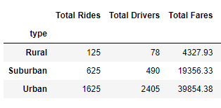
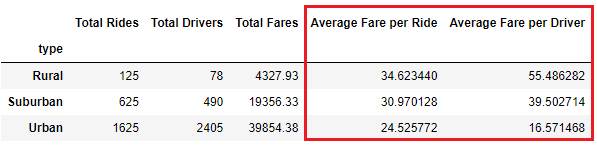
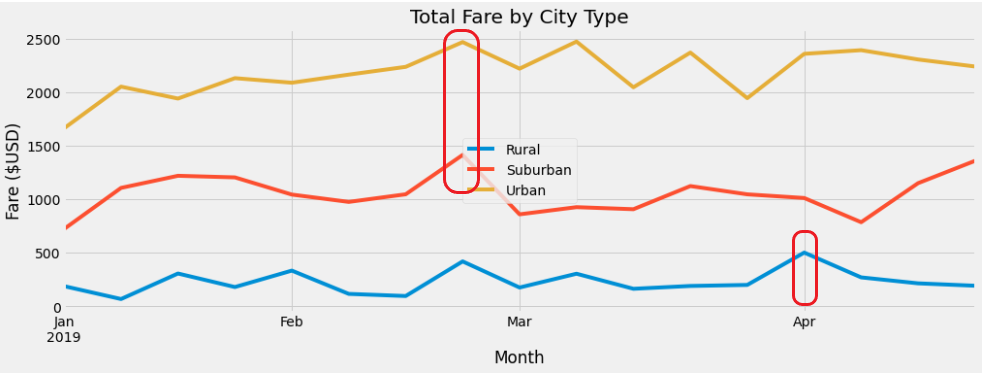

# PyBer_Analysis

## **Overview of PyBer Analysis**

### To create a summary DataFrame of the ride-sharing data by city type and create a multiple-line chart to show the total weekly fares for each city type.

## **Results**

- **Discoveries from the summary DataFrame and multiple-line chart**

  * Urban area had the highest numbers in Total Rides, Total Drivers and Total Fares. Rural area had the lowest numbers in all the abvoementioned studies.
  
  
  
  * Rural area had high numbers in the studies of Average Fare per Ride and Average Fare per Driver compared to Urban and Suburban areas.
  
  
  
  * Throughout the study of the Total Fare between January and April in 2019, Urban and Suburban areas appeared to reach their highest numbers of total fare in late Feburary; Rural area reached its highest number at the end of March/the beginning of April. 
  
  

## **Summary**

- **Recommendations**

